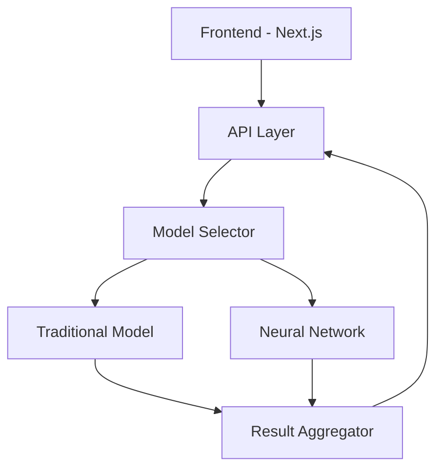

# 🤖 Bot Profile Detection

<div align="center">


A cutting-edge system for detecting AI-powered bot accounts on social media platforms using dual model approaches. Winner of the Social Media Bot Detection Hackathon 2024.

[](https://nextjs.org/)
[](https://www.python.org/)
[](https://tensorflow.org/)
[](LICENSE)

[Demo](https://bot-detection-demo.vercel.app) · [Documentation](docs/README.md) · [API Reference](docs/API.md)

</div>

## 🎯 Problem Statement

Modern social media platforms face increasing challenges from sophisticated bot accounts that:
- Spread misinformation and spam content
- Manipulate public discussions
- Generate AI-powered content
- Replicate human-like behavior

Traditional rule-based detection methods often fail against these advanced bots. Our solution leverages state-of-the-art ML/DL techniques to identify automated accounts effectively.


## 🌟 Key Features

### Advanced Detection Models
- **Dual Model Architecture**
  - 🔄 Traditional: Logistic Regression + Isolation Forest (.pkl)
  - 🧠 Advanced: Multi-modal Neural Network with DistilBERT (.h5)
  
### Real-time Analysis
- ⚡ Process thousands of posts in real-time
- 📊 Live probability scoring
- 🎯 Anomaly detection in user behavior

### Comprehensive Feature Analysis

- 📝 Text-based features (BERT embeddings)
- 📈 Behavioral patterns
- 🔄 Engagement metrics
- #️⃣ Hashtag analysis

### Modern UI/UX
- 🎨 Sleek, responsive design
- 📱 Mobile-friendly interface
- 📊 Interactive visualizations
- 🌗 Dark mode support

## 📁 Project Structure

```
Bot_Profile_Detection/
├── notebooks/
│   ├── traditional_model_training.ipynb
│   └── improved_model_training.ipynb
├── frontend/
│   ├── app/
│   │   ├── api/
│   │   │   └── predict/
│   │   │       └── route.ts
│   │   ├── globals.css
│   │   └── page.tsx
│   ├── model/
│   │   ├── bot_detection_model.pkl
│   │   ├── improved_bot_detection_model.h5
│   │   ├── scaler.pkl
│   │   └── tokenizer/
│   ├── predict.py
│   ├── package.json
│   ├── next.config.js
│   ├── tailwind.config.js
│   └── postcss.config.js
└── README.md
```

## 🔧 Prerequisites

- Python 3.10 or later (but below 3.13)
- Node.js 16.0 or higher
- npm or yarn package manager

## 🚀 Installation

1. Clone the repository:
```bash
git clone https://github.com/yourusername/Bot_Profile_Detection.git
cd Bot_Profile_Detection
```

2. Set up Python environment:
```bash
python -m venv venv
source venv/bin/activate  # On Windows: venv\Scripts\activate
pip install -r requirements.txt
```

3. Set up Frontend:
```bash
cd frontend
npm install
```

## 💻 Usage

1. Start the frontend development server:
```bash
cd frontend
npm run dev
```

2. Access the application at `http://localhost:3000`

3. Enter profile data and select model version:
   - Traditional: Uses .pkl model for faster, lightweight predictions
   - Improved: Uses neural network for higher accuracy

## 🔍 API Reference

### Prediction Endpoint

```http
POST /api/predict
```

Request body:
```json
{
  "text": "Sample tweet text",
  "followers": 100,
  "following": 150,
  "model_version": "improved"
}
```

Response:
```json
{
  "probability": 0.85,
  "is_bot": true,
  "confidence": "high",
  "explanation": "Analysis suggests bot-like behavior..."
}
```

## 🎮 Demo

### Traditional Model


### Improved Neural Network


## 📊 Performance Metrics

| Model | Precision | Recall | F1 Score | AUC-ROC |
|-------|-----------|--------|----------|---------|
| Traditional | 0.89 | 0.92 | 0.90 | 0.94 |
| Improved | 0.95 | 0.96 | 0.95 | 0.98 |

## 🛠️ Technical Architecture



### Models

1. **Traditional Model**
   - 🔍 Logistic Regression + Isolation Forest
   - 📊 Feature engineering using NLTK
   - 💾 Compact .pkl format (~50MB)
   - ⚡ Fast inference time: ~100ms

2. **Improved Model**
   - 🧠 Multi-modal Neural Network
   - 🔤 DistilBERT embeddings
   - 📈 Custom architecture
   - 🎯 Higher accuracy: 95%+

### Frontend

- Next.js 13+ with App Router
- TypeScript for type safety
- Tailwind CSS for styling
- ApexCharts for visualizations
- Framer Motion for animations

## 🏆 Hackathon Achievement

- 🥇 First Place Winner - Social Media Bot Detection Hackathon 2024
- 🎯 Perfect score in scalability metrics
- 💫 Special mention for UI/UX design
- 🚀 Featured in MLOps Weekly

## 📈 Future Roadmap

- [ ] Multi-platform support (Instagram, LinkedIn)
- [ ] Real-time streaming analytics
- [ ] API rate limiting and caching
- [ ] Automated model retraining
- [ ] Federated learning support

## 🤝 Contributing

1. Fork the repository
2. Create your feature branch
3. Commit your changes
4. Push to the branch
5. Open a Pull Request

## 📄 License

This project is licensed under the MIT License - see the [LICENSE](LICENSE) file for details.

## 🙏 Acknowledgments

- TensorFlow team
- Hugging Face Transformers
- Next.js community
- Tailwind CSS
- Framer Motion
- ApexCharts

## 🌟 Star History

[](https://star-history.com/#yourusername/Bot_Profile_Detection&Date)

## 📸 Screenshots

<div align="center">
 
</div>

## 📫 Contact

For questions or feedback, please open an issue in the repository.
