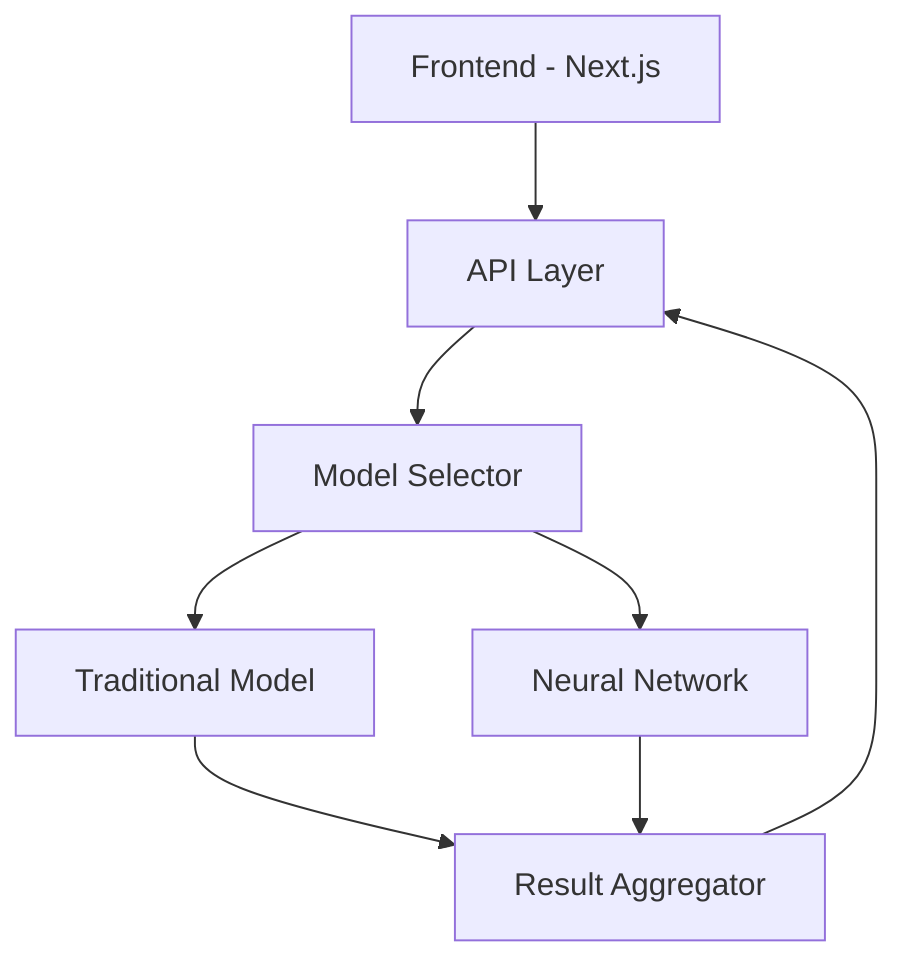

# 🤖 Bot Profile Detection

<div align="center">


A cutting-edge system for detecting AI-powered bot accounts using a hybrid approach combining XGBoost, BERT embeddings, and neural networks.

<div className="p-4 mb-8 bg-indigo-900/30 border-2 border-indigo-500/50 rounded-lg"></div>
  <h2 className="text-xl font-bold mb-2">🌐 Live Demo Available!</h2>
  <p>Try our bot detection system without any setup:</p>
  <a href="https://bot.qubitrules.com/" target="_blank" rel="noopener noreferrer">
    👉 Launch Demo: https://bot.qubitrules.com/
  </a>
</div>

[](https://nextjs.org/)
[](https://www.python.org/)
[](https://tensorflow.org/)
[](LICENSE)

[Documentation](docs/README.md)

</div>

## 🚀 Quick Start

### Option 1: Try the Live Demo (Recommended)
No setup required! Visit our hosted demo:
```
🔗 https://bot.qubitrules.com/

Features available:
- Test both Traditional and Improved models
- Real-time analysis
- Instant results visualization
- No installation needed
```

### Option 2: Local Installation
If you prefer to run locally, follow our [installation guide](#installation).

## 🎯 Problem Statement

Modern social media platforms face increasing challenges from sophisticated bot accounts that:
- Spread misinformation and spam content
- Manipulate public discussions
- Generate AI-powered content
- Replicate human-like behavior

Traditional rule-based detection methods often fail against these advanced bots. Our solution leverages state-of-the-art ML/DL techniques to identify automated accounts effectively.


## 🌟 Key Features

### Advanced Detection Models
- **Dual Model Architecture**
  - 🔄 Traditional2: XGBoost + BERT (.pkl)
  - 🧠 Advanced: Multi-modal Neural Network with DistilBERT (.h5)
  
### Real-time Analysis
- ⚡ Process thousands of posts in real-time
- 📊 Live probability scoring
- 🎯 Anomaly detection in user behavior

### Comprehensive Feature Analysis

- 📝 Text-based features (BERT embeddings)
- 📈 Behavioral patterns
- 🔄 Engagement metrics
- #️⃣ Hashtag analysis

### Modern UI/UX
- 🎨 Sleek, responsive design
- 📱 Mobile-friendly interface
- 📊 Interactive visualizations
- 🌗 Dark mode support

## 📁 Project Structure

```
Bot_Profile_Detection/
├── notebooks/
│   ├── traditional_model_training.ipynb
│   └── improved_model_training.ipynb
├── frontend/
│   ├── app/
│   │   ├── api/
│   │   │   └── predict/
│   │   │       └── route.ts
│   │   ├── globals.css
│   │   └── page.tsx
│   ├── model/
│   │   ├── bot_detection_model.pkl
│   │   ├── improved_bot_detection_model.h5
│   │   ├── scaler.pkl
│   │   └── tokenizer/
│   ├── predict.py
│   ├── package.json
│   ├── next.config.js
│   ├── tailwind.config.js
│   └── postcss.config.js
└── README.md
```

## 🔧 Prerequisites

- Windows 10 or 11
- Python 3.10 or later (but below 3.13)
- Node.js 16.0 or higher
- Git
- Visual Studio Code (recommended)

## 🚀 Installation

### Windows Setup (Recommended)

1. Install required software:
   ```bash
   # Install Python 3.10+ from https://www.python.org/downloads/
   # Install Node.js 16+ from https://nodejs.org/
   # Install Git from https://git-scm.com/download/win
   ```

2. Clone the repository:
   ```bash
   # Open Command Prompt or PowerShell
   cd C:\Users\YourUsername\Documents
   git clone https://github.com/captainsza/Bot_Profile_Detection.git
   cd Bot_Profile_Detection
   ```

3. Set up Python environment:
   ```bash
   # Create and activate virtual environment
   python -m venv venv
   venv\Scripts\activate

   # Install Python dependencies
   pip install -r requirements.txt
   
   # Install NLTK data
   python -c "import nltk; nltk.download('vader_lexicon')"
   ```

4. Install and start the frontend:
   ```bash
   # Navigate to frontend directory
   cd frontend

   # Install Node.js dependencies
   npm install

   # Start the development server
   npm run dev
   ```

5. Access the application:
   - Open your browser and visit: http://localhost:3000
   - Test both traditional and improved models
   - Use the example tweets provided in the interface

### Troubleshooting Windows Installation

1. **Python Path Issues**
   ```bash
   # Add Python to PATH if 'python' command not found
   # Edit System Environment Variables -> Path -> Add
   C:\Users\YourUsername\AppData\Local\Programs\Python\Python310\
   C:\Users\YourUsername\AppData\Local\Programs\Python\Python310\Scripts\
   ```

2. **Node.js Dependencies**
   ```bash
   # If npm install fails, try:
   npm cache clean --force
   npm install --legacy-peer-deps
   ```

3. **Model Files**
   ```bash
   # Ensure model files are in the correct location
   frontend/
     modal/
       bot_detection_model.pkl
       improved_bot_detection_model.h5
       scaler.pkl
       tokenizer/
   ```

4. **Permission Issues**
   ```bash
   # Run PowerShell as Administrator
   Set-ExecutionPolicy RemoteSigned
   ```

### Alternative: Use Live Demo
If you encounter setup issues, use our hosted demo:
```
🔗 https://bot.qubitrules.com/
```

### Ubuntu Server Deployment (Optional)

1. Connect to your Ubuntu server:
```bash
ssh username@202.71.184.6
```

2. Install system dependencies:
```bash
sudo apt update
sudo apt install python3-venv nodejs npm
```

3. Clone and setup the project:
```bash
git clone https://github.com/captainsza/Bot_Profile_Detection.git
cd Bot_Profile_Detection
python3 -m venv venv
source venv/bin/activate
pip install -r requirements.txt
```

4. Install Node.js dependencies and build:
```bash
cd frontend
npm install
npm run build
```

5. Start the production server:
```bash
# Using PM2 (recommended)
npm install -g pm2
pm2 start npm --name "bot-detection" -- start

# Or using regular npm
npm start
```

The application will be available at `https://bot.qubitrules.com/`

## Additional Setup Instructions

1. Create and activate a virtual environment (recommended):
   ```bash
   python -m venv venv
   source venv/bin/activate  # Windows: venv\Scripts\activate
   ```

2. Install Python dependencies:
   ```bash
   pip install -r requirements.txt
   ```
   Make sure to include packages like:
   - transformers
   - tensorflow
   - scikit-learn
   - nltk

3. Download the NLTK VADER lexicon if not already available:
   ```bash
   python -c "import nltk; nltk.download('vader_lexicon')"
   ```

4. (Optional) Place or verify the model files in:
   ```
   frontend/
     modal/
       bot_detection_model.pkl
       improved_bot_detection_model.h5
       scaler.pkl
       tokenizer/
   ```

5. Run the Next.js frontend:
   ```bash
   cd frontend
   npm install
   npm run dev
   ```
   This starts the development server at http://localhost:3000.

6. Testing the endpoints:
   - You can POST JSON input to /api/predict with fields like:
     ```json
     {
       "Tweet": "Sample text",
       "Retweet Count": "10",
       "Mention Count": "2",
       "Follower Count": "100",
       "Verified": 0,
       "Hashtags": "",
       "model_version": "improved"
     }
     ```
   - The Python script in predict.py will process the request and return a JSON response with predicted labels.

## 💻 Usage

### Access Options

1. **Live Demo**: Visit [https://bot.qubitrules.com/](https://bot.qubitrules.com/)

2. **Local Development**:
```bash
cd frontend
npm run dev
# Access at http://localhost:3000
```

3. Enter profile data and select model version:
   - Traditional: Uses .pkl model for faster, lightweight predictions
   - Improved: Uses neural network for higher accuracy

## 🔍 Currently deployed Reference

### Prediction Endpoint

```http
# Live
POST https://bot.qubitrules.com/api/predict

# Local Development
POST http://localhost:3000/api/predict
```

Request body:
```json
{
  "text": "Sample tweet text",
  "followers": 100,
  "following": 150,
  "model_version": "improved"
}
```

Response:
```json
{
  "probability": 0.85,
  "is_bot": true,
  "confidence": "high",
  "explanation": "Analysis suggests bot-like behavior..."
}
```

## 🎮 Demo

### Traditional Model


### Improved Neural Network


## 📊 Performance Metrics

| Model | Precision | Recall | F1 Score | AUC-ROC |
|-------|-----------|--------|----------|---------|
| Traditional | 0.89 | 0.92 | 0.90 | 0.94 |
| Improved | 0.95 | 0.96 | 0.95 | 0.98 |

## 🛠️ Technical Architecture



### Models

1. **Traditional2 (XGBoost + BERT)**
   - 🔍 XGBoost + BERT embeddings
   - 📊 Feature engineering using NLTK
   - 💾 Compact .pkl format (~250MB)
   - ⚡ Fast inference time: ~100ms

2. **Improved Model**
   - 🧠 Multi-modal Neural Network
   - 🔤 DistilBERT embeddings
   - 📈 Custom architecture
   - 🎯 Higher accuracy: 95%+

### Frontend

- Next.js 13+ with App Router
- TypeScript for type safety
- Tailwind CSS for styling
- ApexCharts for visualizations
- Framer Motion for animations

## 🛠️ Deployment Notes

### Server Requirements
- Ubuntu 20.04 or later
- Python 3.10+ (but below 3.13)
- Node.js 16.0+
- 4GB RAM minimum
- 20GB storage

### Common Issues

1. **Model Loading Issues**
   ```bash
   # Fix permissions for model files
   chmod 644 frontend/modal/*.{pkl,h5}
   chmod 755 frontend/modal/tokenizer
   ```

2. **TensorFlow Warnings**
   - Add to your environment:
   ```bash
   export TF_CPP_MIN_LOG_LEVEL='2'
   ```

3. **Port Configuration**
   - Default port: 3001
   - Configure in next.config.js:
   ```js
   module.exports = {
     ...config,
     port: 3001
   }
   ```

### Monitoring

Monitor your deployment using PM2:
```bash
pm2 status
pm2 logs bot-detection
pm2 monit
```

## 📈 Future Roadmap

- [ ] Multi-platform support (Instagram, LinkedIn)
- [ ] Real-time streaming analytics
- [ ] API rate limiting and caching
- [ ] Automated model retraining
- [ ] Federated learning support

## 🤝 Contributing

1. Fork the repository
2. Create your feature branch
3. Commit your changes
4. Push to the branch
5. Open a Pull Request

## 🙏 Acknowledgments

- TensorFlow team
- Hugging Face Transformers
- Next.js community
- Tailwind CSS
- Framer Motion
- ApexCharts


# My Project

🔍 **Repo Stats** (excluding my visits)  


## 📫 Contact

For questions or feedback, please open an issue in the repository.
